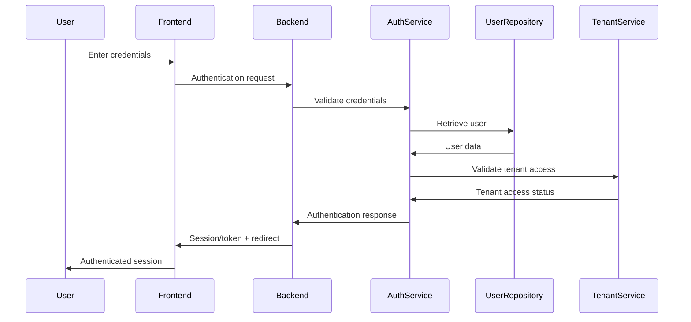

# Fusion CRM V4 - Authentication & Authorization

This document outlines the authentication and authorization architecture for Fusion CRM V4, including user authentication, tenant authorization, role-based access control, and security considerations.

## Overview

Fusion CRM V4's authentication and authorization system is designed to:

1. **Secure User Access**: Verify user identities securely
2. **Enforce Multi-Tenancy**: Ensure data isolation between tenants
3. **Implement Role-Based Access**: Control permissions based on roles
4. **Support Fine-Grained Permissions**: Provide detailed access control
5. **Secure API Access**: Manage authentication for API clients
6. **Enable SSO Integration**: Support single sign-on with external systems
7. **Maintain Audit Trails**: Track access and changes for compliance

## Authentication Technologies

The authentication system leverages these technologies:

1. **Laravel Fortify**: Authentication backend
2. **Laravel Sanctum**: API token authentication
3. **Redis**: Session storage and rate limiting
4. **Laravel Socialite**: OAuth integration for SSO

## User Authentication

### Authentication Methods

Fusion CRM V4 supports multiple authentication methods:

1. **Traditional Email/Password**:
   - Standard username/password authentication
   - Strong password policies
   - Rate-limited login attempts

2. **OAuth Social Authentication**:
   - Google Workspace integration
   - Microsoft Office 365 integration
   - Custom OAuth provider support

3. **SAML-based SSO**:
   - Enterprise single sign-on
   - Integration with identity providers (Okta, OneLogin, etc.)

4. **API Token Authentication**:
   - Personal access tokens
   - OAuth2 client credentials flow
   - Scoped API tokens

### Authentication Flow

The standard authentication flow:



### Implementation

#### Fortify Configuration

Laravel Fortify handles core authentication:

```php
// config/fortify.php
return [
    'guard' => 'web',
    'passwords' => 'users',
    'username' => 'email',
    'email' => 'email',
    'home' => RouteServiceProvider::HOME,
    'middleware' => ['web'],
    'features' => [
        Features::registration(),
        Features::resetPasswords(),
        Features::emailVerification(),
        Features::updateProfileInformation(),
        Features::updatePasswords(),
        Features::twoFactorAuthentication(),
    ],
];
```

#### Custom Authentication Provider

For specialized tenant-aware authentication:

```php
namespace App\Providers;

use App\Services\TenantManager;
use Illuminate\Auth\EloquentUserProvider;
use Illuminate\Contracts\Auth\Authenticatable;

class TenantUserProvider extends EloquentUserProvider
{
    /**
     * The tenant manager instance.
     *
     * @var \App\Services\TenantManager
     */
    protected $tenantManager;
    
    /**
     * Create a new tenant user provider.
     *
     * @param  \Illuminate\Contracts\Hashing\Hasher  $hasher
     * @param  string  $model
     * @param  \App\Services\TenantManager  $tenantManager
     * @return void
     */
    public function __construct($hasher, $model, TenantManager $tenantManager)
    {
        parent::__construct($hasher, $model);
        $this->tenantManager = $tenantManager;
    }
    
    /**
     * Retrieve a user by their unique identifier.
     *
     * @param  mixed  $identifier
     * @return \Illuminate\Contracts\Auth\Authenticatable|null
     */
    public function retrieveById($identifier)
    {
        $user = parent::retrieveById($identifier);
        
        // Check if user belongs to current tenant
        if ($user && $this->tenantManager->checkUserBelongsToTenant($user)) {
            return $user;
        }
        
        return null;
    }
    
    /**
     * Validate a user against the given credentials.
     *
     * @param  \Illuminate\Contracts\Auth\Authenticatable  $user
     * @param  array  $credentials
     * @return bool
     */
    public function validateCredentials(Authenticatable $user, array $credentials)
    {
        $valid = parent::validateCredentials($user, $credentials);
        
        if ($valid) {
            // Check tenant access
            return $this->tenantManager->checkUserBelongsToTenant($user);
        }
        
        return false;
    }
}
```

#### Multi-Factor Authentication

For enhanced security, Fusion CRM V4 implements multi-factor authentication (MFA):

```php
namespace App\Http\Controllers\Auth;

use App\Http\Controllers\Controller;
use Illuminate\Http\Request;
use App\Services\MfaManager;

class MfaController extends Controller
{
    /**
     * The MFA manager instance.
     *
     * @var \App\Services\MfaManager
     */
    protected $mfaManager;
    
    /**
     * Create a new controller instance.
     *
     * @param  \App\Services\MfaManager  $mfaManager
     * @return void
     */
    public function __construct(MfaManager $mfaManager)
    {
        $this->mfaManager = $mfaManager;
    }
    
    /**
     * Show the MFA setup form.
     *
     * @param  \Illuminate\Http\Request  $request
     * @return \Illuminate\Http\Response
     */
    public function setup(Request $request)
    {
        // Generate new MFA secret
        $secret = $this->mfaManager->generateSecret();
        
        // Store secret in session
        $request->session()->put('mfa_secret', $secret);
        
        // Generate QR code
        $qrCode = $this->mfaManager->getQrCode($secret, $request->user()->email);
        
        return view('auth.mfa.setup', compact('qrCode', 'secret'));
    }
    
    /**
     * Enable MFA for the user.
     *
     * @param  \Illuminate\Http\Request  $request
     * @return \Illuminate\Http\Response
     */
    public function enable(Request $request)
    {
        $request->validate([
            'code' => 'required|string',
        ]);
        
        // Get secret from session
        $secret = $request->session()->get('mfa_secret');
        
        // Verify MFA code
        if ($this->mfaManager->verifyCode($secret, $request->code)) {
            // Enable MFA for user
            $request->user()->update([
                'mfa_secret' => $secret,
                'mfa_enabled' => true,
            ]);
            
            // Clear session
            $request->session()->forget('mfa_secret');
            
            return redirect()->route('dashboard')
                ->with('success', 'Multi-factor authentication enabled.');
        }
        
        return back()->withErrors([
            'code' => 'The provided code is invalid.',
        ]);
    }
    
    /**
     * Verify MFA during login.
     *
     * @param  \Illuminate\Http\Request  $request
     * @return \Illuminate\Http\Response
     */
    public function verify(Request $request)
    {
        $request->validate([
            'code' => 'required|string',
        ]);
        
        // Get user ID from session
        $userId = $request->session()->get('mfa_user_id');
        
        if (!$userId) {
            return redirect()->route('login');
        }
        
        // Get user
        $user = User::findOrFail($userId);
        
        // Verify MFA code
        if ($this->mfaManager->verifyCode($user->mfa_secret, $request->code)) {
            // Login user
            Auth::login($user);
            
            // Clear session
            $request->session()->forget('mfa_user_id');
            
            return redirect()->intended(route('dashboard'));
        }
        
        return back()->withErrors([
            'code' => 'The provided code is invalid.',
        ]);
    }
}
```

## Tenant-Based Authorization

Fusion CRM V4's multi-tenant architecture requires tenant-based authorization:

### Tenant Resolution

Tenants are resolved using multiple strategies:

1. **Domain-Based Resolution**:
   - Each tenant can have a custom domain
   - Resolved via middleware

2. **Path-Based Resolution**:
   - Tenants can be identified by URL path
   - `/tenant/{tenant-id}/...`

3. **User-Based Resolution**:
   - Tenant determined by authenticated user
   - Used when domain/path not available

### Tenant Middleware

The tenant middleware handles tenant resolution:

```php
namespace App\Http\Middleware;

use App\Services\TenantManager;
use Closure;
use Illuminate\Http\Request;

class ResolveTenant
{
    /**
     * The tenant manager instance.
     *
     * @var \App\Services\TenantManager
     */
    protected $tenantManager;
    
    /**
     * Create a new middleware instance.
     *
     * @param  \App\Services\TenantManager  $tenantManager
     * @return void
     */
    public function __construct(TenantManager $tenantManager)
    {
        $this->tenantManager = $tenantManager;
    }
    
    /**
     * Handle an incoming request.
     *
     * @param  \Illuminate\Http\Request  $request
     * @param  \Closure  $next
     * @return mixed
     */
    public function handle(Request $request, Closure $next)
    {
        // Resolve tenant
        if (!$this->tenantManager->tenantResolved()) {
            // Try to resolve by domain
            if (!$this->tenantManager->resolveByDomain($request->getHost())) {
                // Try to resolve by path
                if ($request->route('tenant')) {
                    $this->tenantManager->resolveById($request->route('tenant'));
                } elseif ($request->user()) {
                    // Try to resolve by user
                    $this->tenantManager->resolveByUser($request->user());
                } else {
                    // Cannot resolve tenant
                    return $this->handleUnresolvedTenant($request);
                }
            }
        }
        
        // Check tenant is active
        if (!$this->tenantManager->tenantIsActive()) {
            return response()->view('errors.tenant-inactive', [], 403);
        }
        
        return $next($request);
    }
    
    /**
     * Handle an unresolved tenant.
     *
     * @param  \Illuminate\Http\Request  $request
     * @return mixed
     */
    protected function handleUnresolvedTenant(Request $request)
    {
        if ($request->expectsJson()) {
            return response()->json([
                'error' => [
                    'code' => 'tenant_not_found',
                    'message' => 'Tenant could not be resolved.',
                ],
            ], 404);
        }
        
        return response()->view('errors.tenant-not-found', [], 404);
    }
}
```

### Tenant Database Scoping

Database queries are scoped to the current tenant:

```php
namespace App\Traits;

use App\Services\TenantManager;
use Illuminate\Database\Eloquent\Builder;
use Illuminate\Database\Eloquent\Model;

trait HasTenant
{
    /**
     * Boot the has tenant trait for a model.
     *
     * @return void
     */
    public static function bootHasTenant()
    {
        static::addGlobalScope('tenant', function (Builder $builder) {
            $builder->where('tenant_id', app(TenantManager::class)->getTenantId());
        });
        
        static::creating(function (Model $model) {
            if (!isset($model->tenant_id)) {
                $model->tenant_id = app(TenantManager::class)->getTenantId();
            }
        });
    }
    
    /**
     * Get the tenant that owns the model.
     */
    public function tenant()
    {
        return $this->belongsTo(config('fusion.tenant_model', 'App\Models\Tenant'));
    }
}
```

## Role-Based Access Control (RBAC)

Fusion CRM V4 implements a comprehensive RBAC system:

### Roles and Permissions

The RBAC system has these core components:

1. **Roles**: Named collections of permissions (e.g., Admin, Manager, Agent)
2. **Permissions**: Granular access rights (e.g., create_lead, view_report)
3. **User-Role Assignments**: Users are assigned roles within a tenant
4. **Direct Permissions**: Users can have direct permissions without roles

### Database Schema

The core RBAC database schema:

```
roles
- id
- name
- description
- tenant_id
- is_system
- created_at
- updated_at

permissions
- id
- name
- description
- created_at
- updated_at

role_permission
- role_id
- permission_id

user_role
- user_id
- role_id
- tenant_id

user_permission
- user_id
- permission_id
- tenant_id
```

### Permission Implementation

The permission system is implemented with traits:

```php
namespace App\Traits;

use App\Models\Permission;
use App\Models\Role;
use App\Services\TenantManager;

trait HasPermissions
{
    /**
     * Check if the user has a specific permission.
     *
     * @param  string  $permission
     * @return bool
     */
    public function hasPermission($permission)
    {
        // Get current tenant
        $tenantId = app(TenantManager::class)->getTenantId();
        
        // Check direct permissions
        if ($this->permissions()
            ->where('permissions.name', $permission)
            ->where('user_permission.tenant_id', $tenantId)
            ->exists()) {
            return true;
        }
        
        // Check role permissions
        return $this->roles()
            ->where('user_role.tenant_id', $tenantId)
            ->whereHas('permissions', function ($query) use ($permission) {
                $query->where('permissions.name', $permission);
            })
            ->exists();
    }
    
    /**
     * Check if the user has any of the specified permissions.
     *
     * @param  array  $permissions
     * @return bool
     */
    public function hasAnyPermission(array $permissions)
    {
        foreach ($permissions as $permission) {
            if ($this->hasPermission($permission)) {
                return true;
            }
        }
        
        return false;
    }
    
    /**
     * Check if the user has all of the specified permissions.
     *
     * @param  array  $permissions
     * @return bool
     */
    public function hasAllPermissions(array $permissions)
    {
        foreach ($permissions as $permission) {
            if (!$this->hasPermission($permission)) {
                return false;
            }
        }
        
        return true;
    }
    
    /**
     * Check if the user has a specific role.
     *
     * @param  string  $role
     * @return bool
     */
    public function hasRole($role)
    {
        // Get current tenant
        $tenantId = app(TenantManager::class)->getTenantId();
        
        return $this->roles()
            ->where('roles.name', $role)
            ->where('user_role.tenant_id', $tenantId)
            ->exists();
    }
    
    /**
     * Get the roles that belong to the user.
     */
    public function roles()
    {
        return $this->belongsToMany(Role::class, 'user_role')
            ->withPivot('tenant_id')
            ->using(UserRole::class);
    }
    
    /**
     * Get the permissions that belong to the user.
     */
    public function permissions()
    {
        return $this->belongsToMany(Permission::class, 'user_permission')
            ->withPivot('tenant_id')
            ->using(UserPermission::class);
    }
}
```

### Authorization Gate Integration

The RBAC system integrates with Laravel's Gate:

```php
namespace App\Providers;

use App\Models\Permission;
use App\Models\User;
use Illuminate\Foundation\Support\Providers\AuthServiceProvider as ServiceProvider;
use Illuminate\Support\Facades\Gate;

class AuthServiceProvider extends ServiceProvider
{
    /**
     * Register any authentication / authorization services.
     *
     * @return void
     */
    public function boot()
    {
        $this->registerPolicies();
        
        // Load permissions from database
        try {
            $permissions = Permission::all();
            
            foreach ($permissions as $permission) {
                Gate::define($permission->name, function (User $user) use ($permission) {
                    return $user->hasPermission($permission->name);
                });
            }
        } catch (\Exception $e) {
            // Handle database not available exception
        }
        
        // Define super admin role
        Gate::before(function (User $user) {
            if ($user->hasRole('super_admin')) {
                return true;
            }
        });
    }
}
```

### Blade Directive Integration

Custom Blade directives simplify permission checks in views:

```php
namespace App\Providers;

use Illuminate\Support\Facades\Blade;
use Illuminate\Support\ServiceProvider;

class AppServiceProvider extends ServiceProvider
{
    /**
     * Bootstrap any application services.
     *
     * @return void
     */
    public function boot()
    {
        // Permission directive
        Blade::directive('permission', function ($expression) {
            return "<?php if (auth()->check() && auth()->user()->hasPermission({$expression})): ?>";
        });
        
        Blade::directive('endpermission', function () {
            return "<?php endif; ?>";
        });
        
        // Role directive
        Blade::directive('role', function ($expression) {
            return "<?php if (auth()->check() && auth()->user()->hasRole({$expression})): ?>";
        });
        
        Blade::directive('endrole', function () {
            return "<?php endif; ?>";
        });
    }
}
```

## Object-Level Access Control

Beyond role-based permissions, Fusion CRM V4 implements object-level access control:

### Team-Based Access

Users can be organized into teams with specific access rights:

```php
namespace App\Models;

use Illuminate\Database\Eloquent\Model;
use Illuminate\Database\Eloquent\SoftDeletes;
use App\Traits\HasTenant;

class Team extends Model
{
    use SoftDeletes, HasTenant;
    
    protected $fillable = [
        'name',
        'description',
        'tenant_id',
    ];
    
    /**
     * Get the users that belong to the team.
     */
    public function users()
    {
        return $this->belongsToMany(User::class, 'team_user')
            ->withTimestamps();
    }
    
    /**
     * Get the objects that are assigned to the team.
     */
    public function leads()
    {
        return $this->morphedByMany(Lead::class, 'teamable');
    }
    
    public function deals()
    {
        return $this->morphedByMany(Deal::class, 'teamable');
    }
    
    public function properties()
    {
        return $this->morphedByMany(Property::class, 'teamable');
    }
}
```

### Ownership-Based Access

Entity ownership controls access permissions:

```php
namespace App\Models;

use Illuminate\Database\Eloquent\Model;
use Illuminate\Database\Eloquent\SoftDeletes;
use App\Traits\HasTenant;

class Lead extends Model
{
    use SoftDeletes, HasTenant;
    
    protected $fillable = [
        'first_name',
        'last_name',
        'email',
        'phone',
        'status',
        'source',
        'source_detail',
        'score',
        'assigned_to',
        'tenant_id',
        // ... other fields
    ];
    
    /**
     * Get the user that owns the lead.
     */
    public function assignedUser()
    {
        return $this->belongsTo(User::class, 'assigned_to');
    }
    
    /**
     * Get the teams that have access to the lead.
     */
    public function teams()
    {
        return $this->morphToMany(Team::class, 'teamable');
    }
    
    /**
     * Determine if the user can access this lead.
     *
     * @param  \App\Models\User  $user
     * @return bool
     */
    public function canBeAccessedBy(User $user)
    {
        // User is the owner
        if ($this->assigned_to === $user->id) {
            return true;
        }
        
        // User is on a team that has access
        if ($this->teams()->whereHas('users', function ($query) use ($user) {
            $query->where('users.id', $user->id);
        })->exists()) {
            return true;
        }
        
        // User has global access permission
        if ($user->hasPermission('view_all_leads')) {
            return true;
        }
        
        return false;
    }
}
```

### Policy Implementation

Laravel Policies enforce access control:

```php
namespace App\Policies;

use App\Models\Lead;
use App\Models\User;
use Illuminate\Auth\Access\HandlesAuthorization;

class LeadPolicy
{
    use HandlesAuthorization;
    
    /**
     * Determine whether the user can view any leads.
     *
     * @param  \App\Models\User  $user
     * @return \Illuminate\Auth\Access\Response|bool
     */
    public function viewAny(User $user)
    {
        return $user->hasPermission('view_leads');
    }
    
    /**
     * Determine whether the user can view the lead.
     *
     * @param  \App\Models\User  $user
     * @param  \App\Models\Lead  $lead
     * @return \Illuminate\Auth\Access\Response|bool
     */
    public function view(User $user, Lead $lead)
    {
        // Check if user can access the lead
        if ($lead->canBeAccessedBy($user)) {
            return true;
        }
        
        return $user->hasPermission('view_all_leads');
    }
    
    /**
     * Determine whether the user can create leads.
     *
     * @param  \App\Models\User  $user
     * @return \Illuminate\Auth\Access\Response|bool
     */
    public function create(User $user)
    {
        return $user->hasPermission('create_leads');
    }
    
    /**
     * Determine whether the user can update the lead.
     *
     * @param  \App\Models\User  $user
     * @param  \App\Models\Lead  $lead
     * @return \Illuminate\Auth\Access\Response|bool
     */
    public function update(User $user, Lead $lead)
    {
        // User can update their own leads
        if ($lead->assigned_to === $user->id) {
            return $user->hasPermission('update_own_leads');
        }
        
        // User can update leads in their team
        if ($lead->teams()->whereHas('users', function ($query) use ($user) {
            $query->where('users.id', $user->id);
        })->exists()) {
            return $user->hasPermission('update_team_leads');
        }
        
        // User can update any lead
        return $user->hasPermission('update_all_leads');
    }
    
    /**
     * Determine whether the user can delete the lead.
     *
     * @param  \App\Models\User  $user
     * @param  \App\Models\Lead  $lead
     * @return \Illuminate\Auth\Access\Response|bool
     */
    public function delete(User $user, Lead $lead)
    {
        return $user->hasPermission('delete_leads');
    }
}
```

## API Authentication

The API authentication system includes:

### Token-Based Authentication

Personal access tokens for API access:

```php
namespace App\Http\Controllers\Api;

use App\Http\Controllers\Controller;
use App\Models\User;
use Illuminate\Http\Request;
use Illuminate\Support\Facades\Hash;
use Laravel\Sanctum\NewAccessToken;

class TokenController extends Controller
{
    /**
     * Create a new token.
     *
     * @param  \Illuminate\Http\Request  $request
     * @return \Illuminate\Http\JsonResponse
     */
    public function store(Request $request)
    {
        $request->validate([
            'email' => 'required|email',
            'password' => 'required',
            'device_name' => 'required',
            'scopes' => 'array',
        ]);
        
        $user = User::where('email', $request->email)->first();
        
        if (!$user || !Hash::check($request->password, $user->password)) {
            return response()->json([
                'error' => [
                    'code' => 'invalid_credentials',
                    'message' => 'The provided credentials are incorrect.',
                ]
            ], 401);
        }
        
        // Determine token scopes
        $scopes = $request->scopes ?? ['*'];
        
        // Create token
        $token = $user->createToken($request->device_name, $scopes);
        
        return response()->json([
            'token' => $token->plainTextToken,
            'scopes' => $scopes,
            'expires_at' => null, // Tokens don't expire by default
        ]);
    }
}
```

### OAuth2 Client Credentials

For service-to-service authentication:

```php
namespace App\Http\Controllers\Api;

use App\Http\Controllers\Controller;
use App\Models\ApiClient;
use Illuminate\Http\Request;
use Illuminate\Support\Facades\Hash;
use Illuminate\Support\Str;
use Laravel\Sanctum\NewAccessToken;

class OAuth2Controller extends Controller
{
    /**
     * Handle client credentials grant.
     *
     * @param  \Illuminate\Http\Request  $request
     * @return \Illuminate\Http\JsonResponse
     */
    public function clientCredentials(Request $request)
    {
        $request->validate([
            'client_id' => 'required|string',
            'client_secret' => 'required|string',
            'scope' => 'nullable|string',
        ]);
        
        // Find client
        $client = ApiClient::where('client_id', $request->client_id)->first();
        
        if (!$client || !Hash::check($request->client_secret, $client->client_secret)) {
            return response()->json([
                'error' => 'invalid_client',
                'error_description' => 'Client authentication failed',
            ], 401);
        }
        
        // Check if client is active
        if (!$client->is_active) {
            return response()->json([
                'error' => 'invalid_client',
                'error_description' => 'Client is inactive',
            ], 401);
        }
        
        // Determine scopes
        $requestedScopes = $request->scope ? explode(' ', $request->scope) : [];
        $allowedScopes = $client->scopes ? json_decode($client->scopes, true) : [];
        
        // Filter requested scopes by allowed scopes
        $scopes = empty($requestedScopes) ? $allowedScopes : array_intersect($requestedScopes, $allowedScopes);
        
        // Create token for tenant
        $token = $client->createToken(
            'client-credentials-' . Str::random(10),
            $scopes,
            now()->addSeconds($client->token_expires_in ?? 3600)
        );
        
        return response()->json([
            'token_type' => 'Bearer',
            'expires_in' => $client->token_expires_in ?? 3600,
            'access_token' => $token->plainTextToken,
            'scope' => implode(' ', $scopes),
        ]);
    }
}
```

### API Scope Enforcement

API endpoints are protected by scopes:

```php
namespace App\Http\Middleware;

use Closure;
use Illuminate\Auth\AuthenticationException;
use Illuminate\Http\Request;

class CheckApiScopes
{
    /**
     * Handle an incoming request.
     *
     * @param  \Illuminate\Http\Request  $request
     * @param  \Closure  $next
     * @param  string  ...$scopes
     * @return mixed
     *
     * @throws \Illuminate\Auth\AuthenticationException
     */
    public function handle(Request $request, Closure $next, ...$scopes)
    {
        if (!$request->user() || !$request->user()->currentAccessToken()) {
            throw new AuthenticationException;
        }
        
        $tokenScopes = $request->user()->currentAccessToken()->abilities;
        
        // Check if token has wildcard scope
        if (in_array('*', $tokenScopes)) {
            return $next($request);
        }
        
        // Check if token has all required scopes
        foreach ($scopes as $scope) {
            if (!in_array($scope, $tokenScopes)) {
                return response()->json([
                    'error' => [
                        'code' => 'insufficient_scope',
                        'message' => 'The token does not have the required scope.',
                    ]
                ], 403);
            }
        }
        
        return $next($request);
    }
}
```

## Security Measures

Fusion CRM V4 implements several security measures:

### Password Policies

Strong password requirements:

```php
namespace App\Rules;

use Illuminate\Contracts\Validation\Rule;

class StrongPassword implements Rule
{
    /**
     * Determine if the validation rule passes.
     *
     * @param  string  $attribute
     * @param  mixed  $value
     * @return bool
     */
    public function passes($attribute, $value)
    {
        // At least 8 characters
        if (strlen($value) < 8) {
            return false;
        }
        
        // At least one uppercase letter
        if (!preg_match('/[A-Z]/', $value)) {
            return false;
        }
        
        // At least one lowercase letter
        if (!preg_match('/[a-z]/', $value)) {
            return false;
        }
        
        // At least one digit
        if (!preg_match('/\d/', $value)) {
            return false;
        }
        
        // At least one special character
        if (!preg_match('/[^A-Za-z0-9]/', $value)) {
            return false;
        }
        
        return true;
    }
    
    /**
     * Get the validation error message.
     *
     * @return string
     */
    public function message()
    {
        return 'The :attribute must be at least 8 characters and contain at least one uppercase letter, one lowercase letter, one number, and one special character.';
    }
}
```

### CSRF Protection

CSRF protection for web routes:

```php
namespace App\Http\Middleware;

use Illuminate\Foundation\Http\Middleware\VerifyCsrfToken as Middleware;

class VerifyCsrfToken extends Middleware
{
    /**
     * The URIs that should be excluded from CSRF verification.
     *
     * @var array
     */
    protected $except = [
        // Webhook routes
        'webhooks/*',
        // API routes (already protected by tokens)
        'api/*',
    ];
}
```

### Rate Limiting

Rate limiting to prevent brute force attacks:

```php
namespace App\Providers;

use Illuminate\Cache\RateLimiting\Limit;
use Illuminate\Http\Request;
use Illuminate\Support\Facades\RateLimiter;
use Illuminate\Support\ServiceProvider;

class AppServiceProvider extends ServiceProvider
{
    /**
     * Bootstrap any application services.
     *
     * @return void
     */
    public function boot()
    {
        // Rate limit login attempts
        RateLimiter::for('login', function (Request $request) {
            $key = $request->ip();
            
            return Limit::perMinute(5)->by($key);
        });
        
        // Rate limit password reset attempts
        RateLimiter::for('password-reset', function (Request $request) {
            $key = $request->email . $request->ip();
            
            return Limit::perHour(3)->by($key);
        });
        
        // Rate limit API requests
        RateLimiter::for('api', function (Request $request) {
            $user = $request->user();
            
            return Limit::perMinute($user ? 120 : 60)
                ->by($user ? $user->id : $request->ip());
        });
    }
}
```

### Security Headers

Security headers for all responses:

```php
namespace App\Http\Middleware;

use Closure;
use Illuminate\Http\Request;

class SecurityHeaders
{
    /**
     * Handle an incoming request.
     *
     * @param  \Illuminate\Http\Request  $request
     * @param  \Closure  $next
     * @return mixed
     */
    public function handle(Request $request, Closure $next)
    {
        $response = $next($request);
        
        // Content-Security-Policy
        $response->headers->set('Content-Security-Policy', "default-src 'self'; script-src 'self' 'unsafe-inline' 'unsafe-eval' *.googleapis.com *.gstatic.com; connect-src 'self' *.fusion.app; img-src 'self' data: blob: *.googleapis.com *.gstatic.com; style-src 'self' 'unsafe-inline' *.googleapis.com; font-src 'self' data: *.gstatic.com; frame-src 'self'; object-src 'none'");
        
        // X-Content-Type-Options
        $response->headers->set('X-Content-Type-Options', 'nosniff');
        
        // X-Frame-Options
        $response->headers->set('X-Frame-Options', 'SAMEORIGIN');
        
        // X-XSS-Protection
        $response->headers->set('X-XSS-Protection', '1; mode=block');
        
        // Referrer-Policy
        $response->headers->set('Referrer-Policy', 'strict-origin-when-cross-origin');
        
        // Permissions-Policy
        $response->headers->set('Permissions-Policy', 'camera=(), microphone=(), geolocation=()');
        
        // HSTS (Strict-Transport-Security)
        if (app()->environment('production')) {
            $response->headers->set('Strict-Transport-Security', 'max-age=31536000; includeSubDomains');
        }
        
        return $response;
    }
}
```

### Audit Logging

Comprehensive audit logging for security events:

```php
namespace App\Services;

use App\Models\AuditLog;
use Illuminate\Support\Facades\Auth;
use Illuminate\Support\Facades\Request;

class AuditLogger
{
    /**
     * Log an audit event.
     *
     * @param  string  $action
     * @param  string  $entity
     * @param  int|null  $entityId
     * @param  array  $oldValues
     * @param  array  $newValues
     * @return void
     */
    public function log($action, $entity, $entityId = null, $oldValues = [], $newValues = [])
    {
        // Create audit log entry
        AuditLog::create([
            'user_id' => Auth::id(),
            'tenant_id' => app(TenantManager::class)->getTenantId(),
            'action' => $action,
            'entity' => $entity,
            'entity_id' => $entityId,
            'old_values' => $oldValues,
            'new_values' => $newValues,
            'ip_address' => Request::ip(),
            'user_agent' => Request::userAgent(),
        ]);
    }
}
```

### Two-Factor Authentication

Two-factor authentication with time-based one-time passwords (TOTP):

```php
namespace App\Services;

use PragmaRX\Google2FA\Google2FA;
use SimpleSoftwareIO\QrCode\Facades\QrCode;

class MfaManager
{
    /**
     * The Google2FA instance.
     *
     * @var \PragmaRX\Google2FA\Google2FA
     */
    protected $google2fa;
    
    /**
     * Create a new MFA manager instance.
     *
     * @param  \PragmaRX\Google2FA\Google2FA  $google2fa
     * @return void
     */
    public function __construct(Google2FA $google2fa)
    {
        $this->google2fa = $google2fa;
    }
    
    /**
     * Generate a new secret.
     *
     * @return string
     */
    public function generateSecret()
    {
        return $this->google2fa->generateSecretKey();
    }
    
    /**
     * Get a QR code for the given secret.
     *
     * @param  string  $secret
     * @param  string  $email
     * @return string
     */
    public function getQrCode($secret, $email)
    {
        $qrCodeUrl = $this->google2fa->getQRCodeUrl(
            config('app.name'),
            $email,
            $secret
        );
        
        return QrCode::size(200)->generate($qrCodeUrl);
    }
    
    /**
     * Verify a code against a secret.
     *
     * @param  string  $secret
     * @param  string  $code
     * @return bool
     */
    public function verifyCode($secret, $code)
    {
        return $this->google2fa->verifyKey($secret, $code);
    }
}
```

## Session Management

Sessions are secured and managed:

### Session Configuration

```php
// config/session.php
return [
    'driver' => env('SESSION_DRIVER', 'redis'),
    'lifetime' => env('SESSION_LIFETIME', 120),
    'expire_on_close' => false,
    'encrypt' => true,
    'files' => storage_path('framework/sessions'),
    'connection' => env('SESSION_CONNECTION', null),
    'table' => 'sessions',
    'store' => env('SESSION_STORE', null),
    'lottery' => [2, 100],
    'cookie' => env(
        'SESSION_COOKIE',
        Str::slug(env('APP_NAME', 'laravel'), '_').'_session'
    ),
    'path' => '/',
    'domain' => env('SESSION_DOMAIN', null),
    'secure' => env('SESSION_SECURE_COOKIE', true),
    'http_only' => true,
    'same_site' => 'lax',
];
```

### Session Middleware

```php
namespace App\Http\Middleware;

use Closure;
use Illuminate\Http\Request;
use Illuminate\Session\Middleware\StartSession as BaseStartSession;

class StartSession extends BaseStartSession
{
    /**
     * Handle an incoming request.
     *
     * @param  \Illuminate\Http\Request  $request
     * @param  \Closure  $next
     * @return mixed
     */
    public function handle($request, Closure $next)
    {
        $response = parent::handle($request, $next);
        
        // Regenerate session ID periodically to prevent session fixation
        if ($request->user() && !$request->ajax() && random_int(1, 10) === 1) {
            $request->session()->regenerate();
        }
        
        return $response;
    }
}
```

## Conclusion

The authentication and authorization architecture for Fusion CRM V4 provides a comprehensive, secure framework for user management, tenant isolation, and access control. By implementing robust authentication methods, role-based permissions, object-level access control, and security best practices, the system ensures that sensitive data is protected while providing the flexibility required for a complex multi-tenant application. 